# Báo cáo phân tích mô tả nhu cầu sản phẩm

File này không train model. Mục tiêu là hiểu dữ liệu trước khi dự báo.

## Tiền xử lý

- Dòng gốc: 1,067,371
- Dòng gross sales sạch: 976,674 (91.50%)
- Dòng trùng: 34,335
- Dòng hủy: 19,494
- Tuần biên bị loại: 2009-11-30/2009-12-06, 2011-12-05/2011-12-11
- Giao dịch sạch thiếu Customer ID: 22.45% (vẫn được giữ)

## Phạm vi

- Số StockCode: 4,881
- Số tuần hoàn chỉnh: 102
- Tỷ lệ tuần zero trong vòng đời sản phẩm: 40.10%
- Mã StockCode không chuẩn cần duyệt: 211

## Mức tập trung

- Top 10 sản phẩm: 7.41% Quantity
- Top 50 sản phẩm: 19.29% Quantity
- Top 20% sản phẩm: 78.29% Quantity

## Cách đọc các file

1. `01_missing_values.csv`: dữ liệu thiếu.
2. `03_weekly_market_trend.csv`: xu hướng theo tuần và moving average 4 tuần.
3. `07_all_product_summary.csv`: toàn bộ chỉ số theo sản phẩm.
4. `11_nonstandard_stock_codes.csv`: mã cần xác minh có phải hàng hóa thật hay không.
5. `13_product_demand_profile.csv`: zero rate, ADI, CV² và loại nhu cầu.
6. `15_quantity_pareto.csv`: mức đóng góp Quantity tích lũy.
7. `17_country_summary.csv`: mức đóng góp theo quốc gia.
8. `18_cancelled_invoice_records.csv`: toàn bộ bản ghi gốc có Invoice bắt đầu bằng C.
9. `19_returns_by_product.csv`: sản phẩm có nhiều lượng trả/hủy.

## Biểu đồ

1. 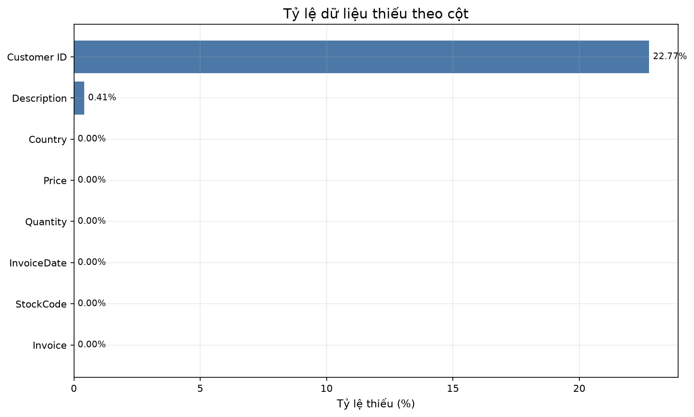
2. 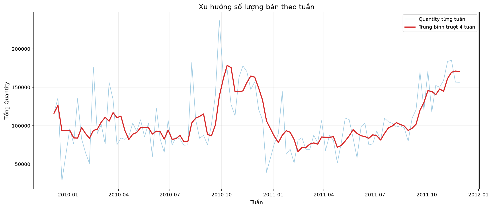
3. 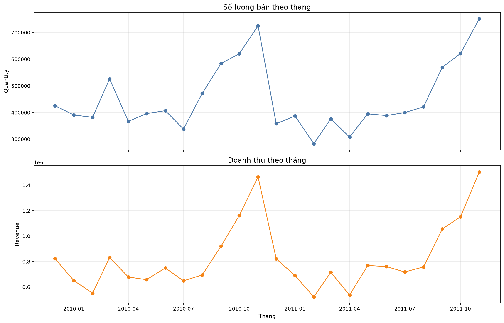
4. 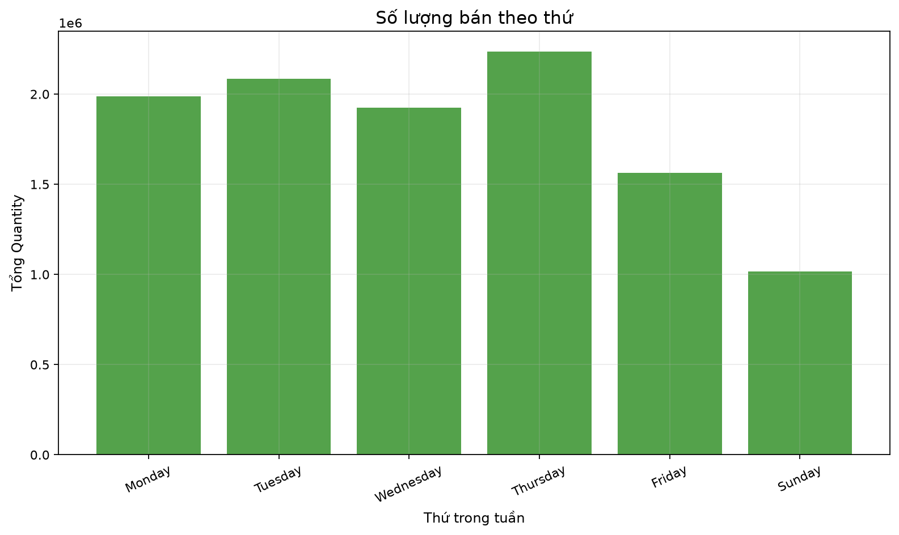
5. 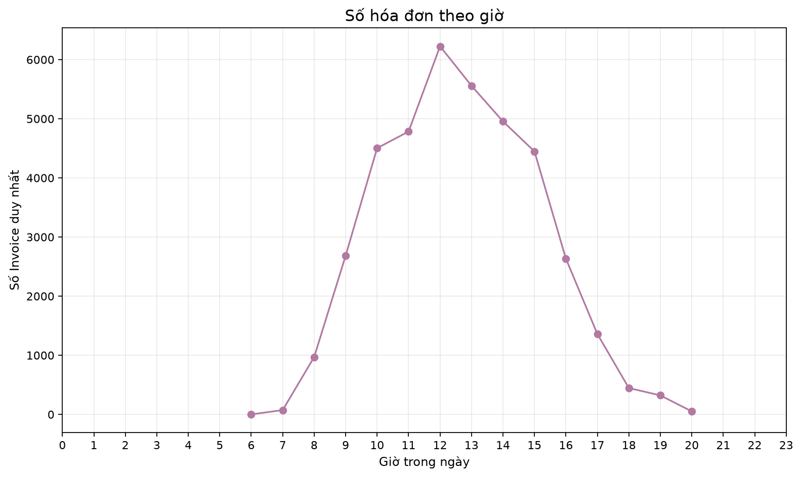
6. 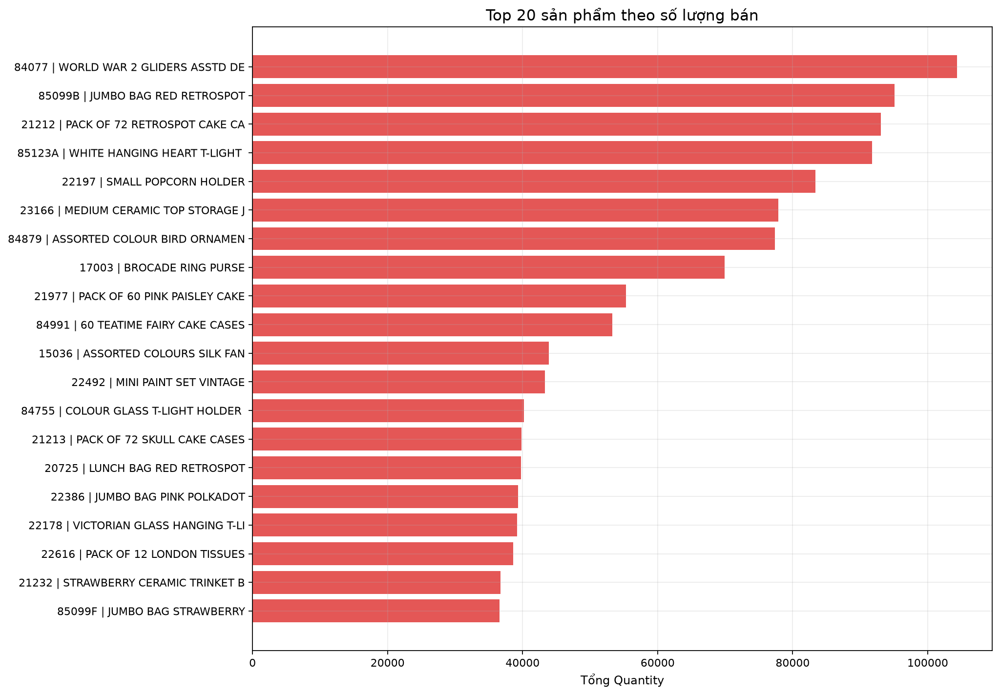
7. 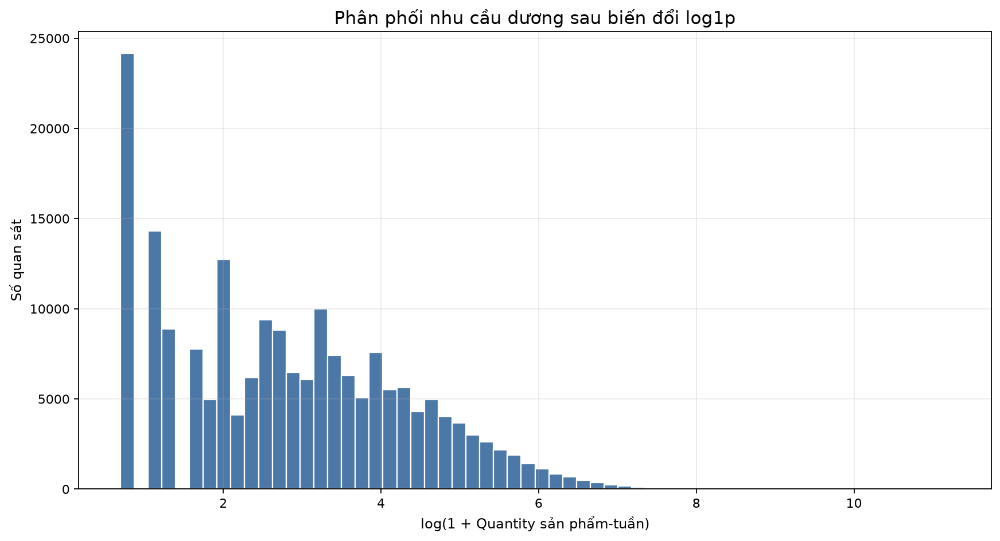
8. 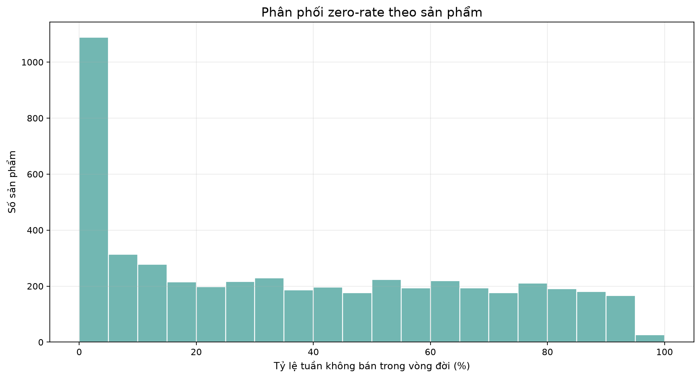
9. 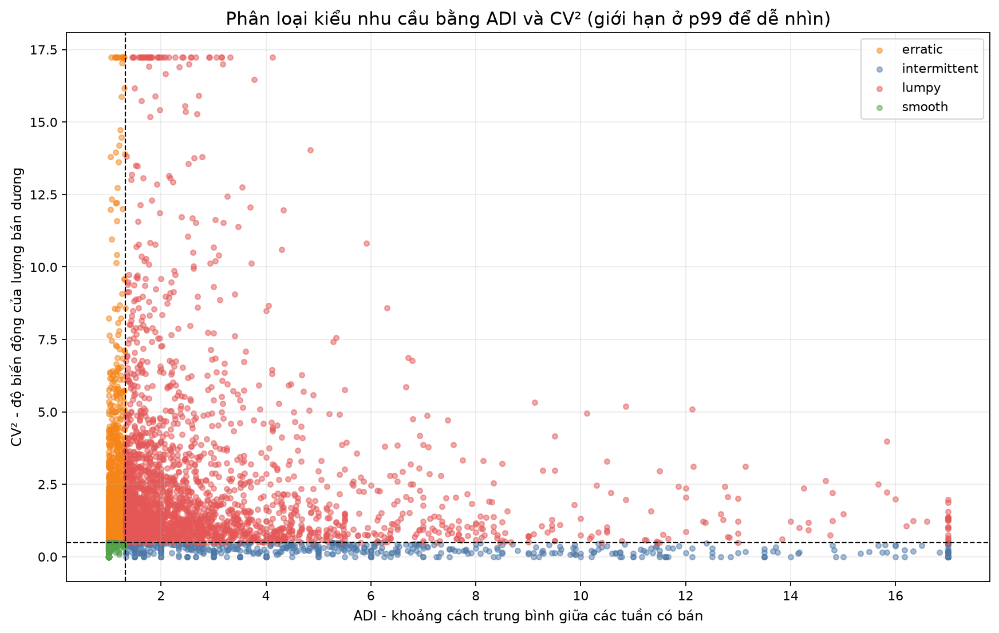
10. 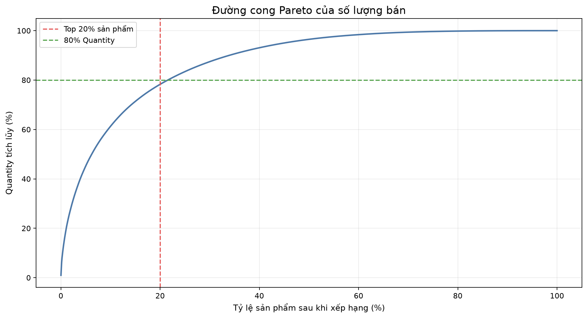
11. 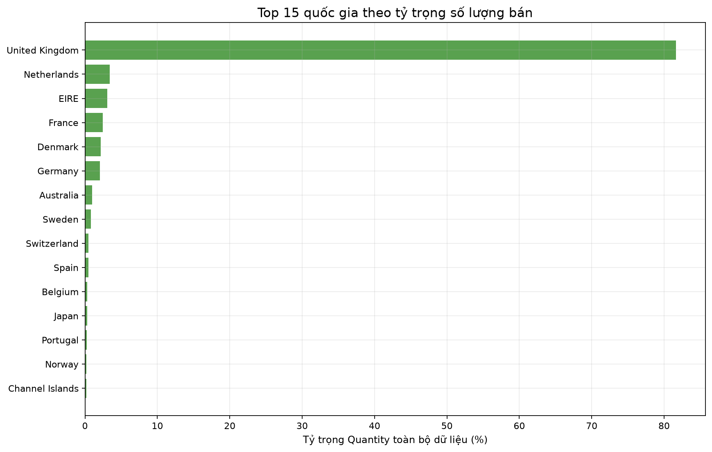
12. 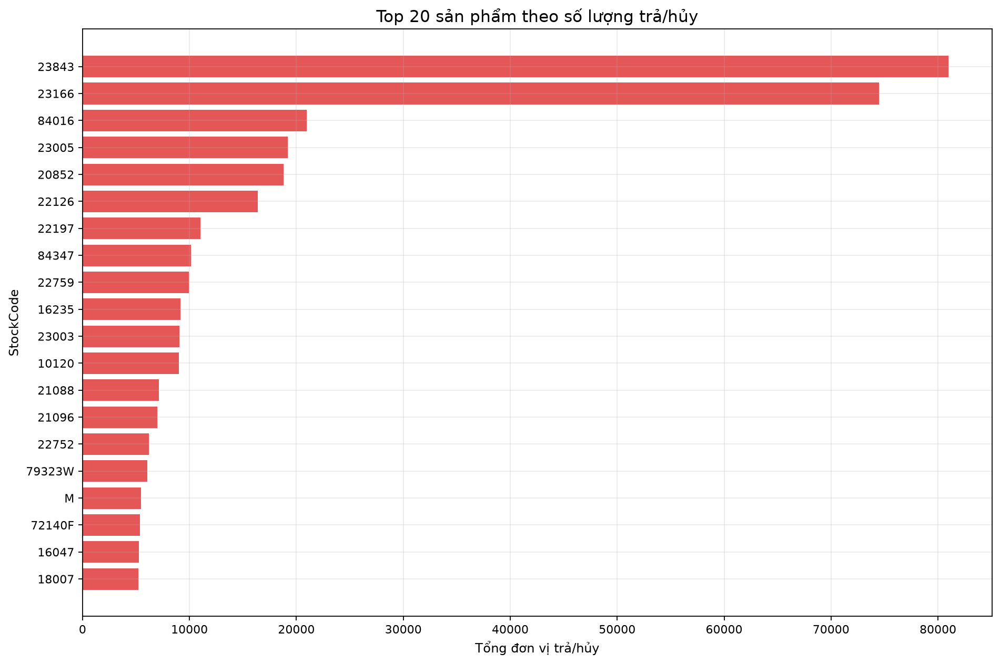
13. 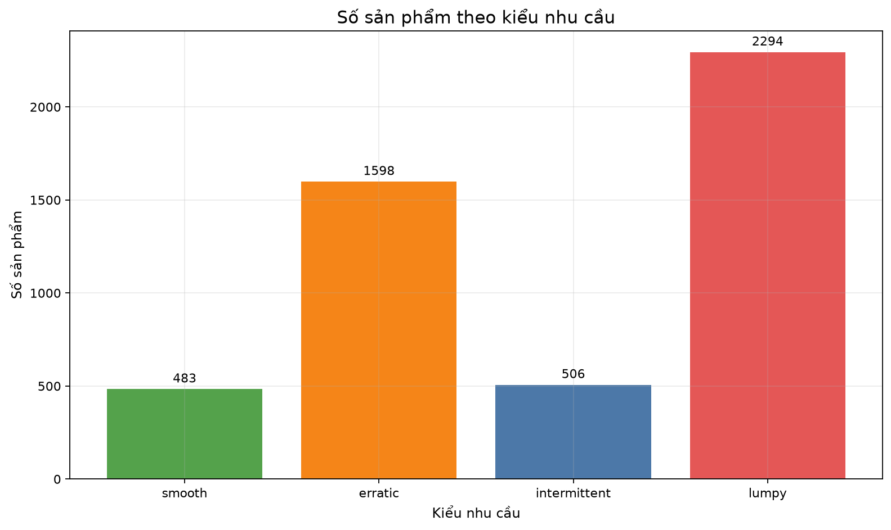
14. 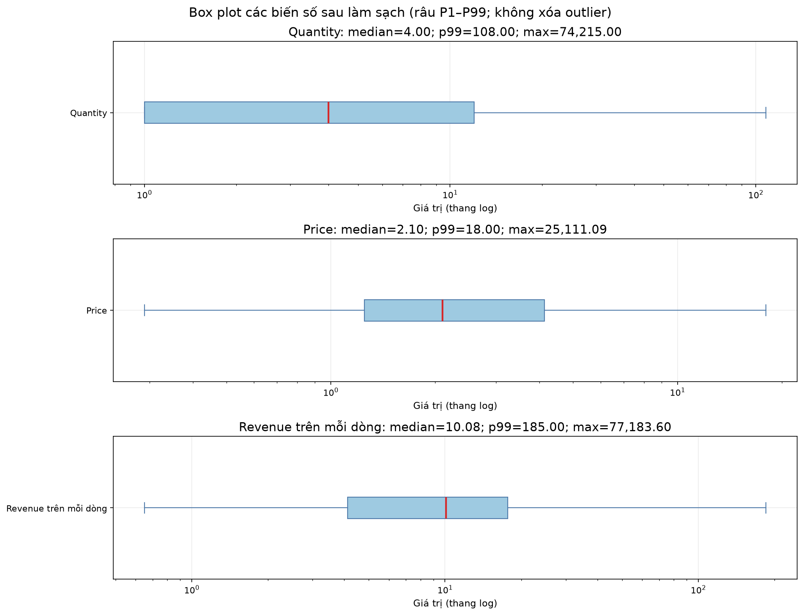

## Chưa được phép kết luận

- Tương quan giá và Quantity không tự động chứng minh giá gây ra nhu cầu.
- Outlier chưa được xóa vì có thể là đơn bán buôn thật.
- Mã không chuẩn chưa bị xóa khi chưa có quyết định nghiệp vụ.
- Dữ liệu chỉ khoảng hai năm, nên bằng chứng mùa vụ còn hạn chế.
